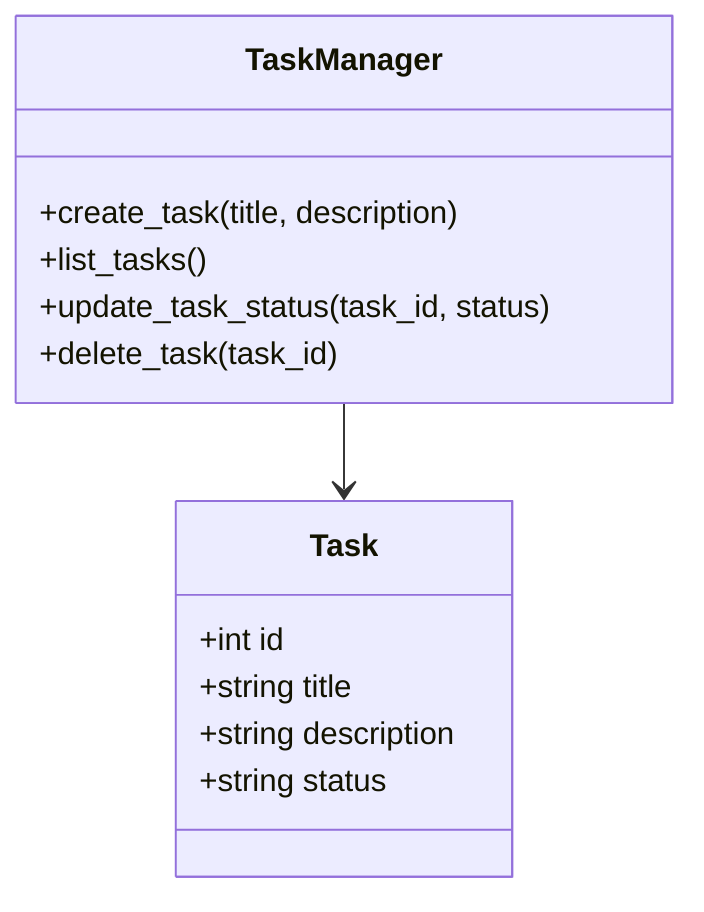

# Diagrama de Classes

```mermaid
classDiagram
    class Task {
        +int id
        +string title
        +string description
        +string status
    }

    class TaskManager {
        +create_task(title, description)
        +list_tasks()
        +update_task_status(task_id, status)
        +delete_task(task_id)
    }

    TaskManager --> Task
```
